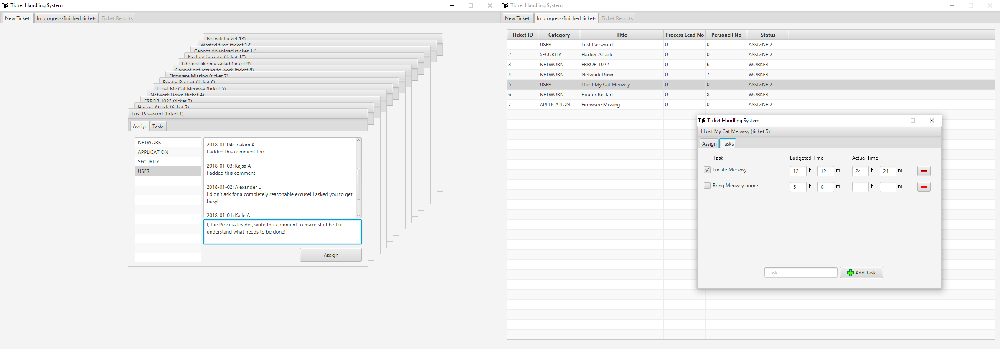
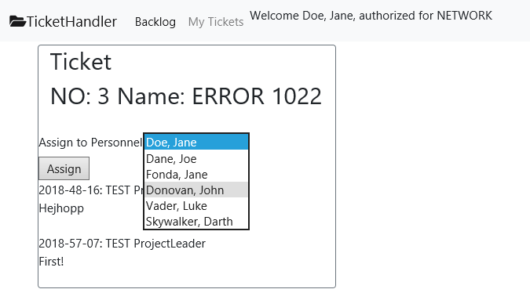

# Ticket Handling System (THS)

A prototype Issue Tracking System made for a university assignment in [Software Development with Java II](https://www.ltu.se/edu/course/D00/D0024E/D0024E-Programutveckling-med-Java-II-1.161024?l=en) at Luleå University of Technology.

The system has two views, one for a Process Leader who assigns "tickets" with issues to teams, a desktop application written in JavaFX. 



The other view serves team members and is accessed via web browser, this part is written in JSF. A team member assigns a ticket to the person most suited to handle the ticket in the team.



## Prerequisites and Installing

If you use the same tools as us (below), set up your database and Tomcat/Glassfish server correctly you should be able to get the project running. Although, make sure database passwords and addresses are correct for your setup. 

Also, initialize the /databas/THSDB.mwb script which creates the model, then fill the model with the test data in /databas/testdata and load the stored procedures in /databas/storedProcedures/ to your database.

## Built With
* JAVA 8.x
* NetBeans 8.x
* MySQL and MySQL Workbench
* Tomcat or Glassfish
* JavaEE
* JavaFX

## Known Issues

### Database and Model Issues
* Our choice of JDBC with Stored Procedures in our local database (MYSQL) made version control a bit more complex since we initially chose to handle them outside of Git/GitHub.
* The model-classes where not very complex but placing our business logic in one large class was a bad design choice. 
* No major considerations were made considering the security of the database and modell design, since it was outside our scope.

### JSF Issues

We have encountered severe problems in our JSF ManagedBean beacuase of bad design choices and lack of understanding of the initialization functions in JSF.
* Our Bean has lots of logic operations to locally form and sort tickets and personnel to give the right content. This leaves lots of vulnerabilities for the next problem.
* The JSF markdown in XHTML initializes its backing fields in ways we didn't expect and this caused problems when expanding from basic funtionallity to more complex dynamic functions.
``` XHTML
<h:selectOneMenu styleClass="m-1" value="#{THSMB.personnelNo}" >
    <f:selectItems value="#{THSMB.personnels}" var="personnel" 
                   itemLabel="#{personnel.lastName}, #{personnel.firstName}" itemValue="#{personnel.staffNo}"/>
</h:selectOneMenu>  
``` 
* The second view needed its own Bean-class but the first issue in this list made this complicated and the working version of task.xhtml had functions deviating from the expected such as unregulated stepping forward in the ticketslist and showing the wrong tasks on reload. 

### JavaFX Issues
We were unable to implement some late functionality and finishing touches in the JavaFX view, but the program can mostly be used as intended and is not too far from a fully stable release.
* Tasks are not loaded when viewing a ticket. Hotfix needed.
* Bug: Tickets marked as "WORKING" cannot be opened. Hotfix needed.
* Some calls should be made to refresh the data at a few points in the program. We have prepared for an observable pattern against the database, but have not implemented this yet.
* Process Leader ID is hard-coded into the application for demonstration purposes, this should be generalised.
* Functionality for Process Leader to attest a ticket that has been marked as "DONE" is not yet implemented.
* Although we believe the code is of quality, some of it is bloaty and should be refactored. 

## Authors
[Björn Bergdahl](https://github.com/BjornBergdahl)

[Andreas Kuoppa](https://github.com/Acoped)

## License and Contributing

Now, when we have turned in the project, we grant some rights to people for further development as per below.

The [MIT License](https://opensource.org/licenses/MIT)

Copyright 2018 Björn Bergdahl and Andreas Kuoppa

Permission is hereby granted, free of charge, to any person obtaining a copy of this software and associated documentation files (the "Software"), to deal in the Software without restriction, including without limitation the rights to use, copy, modify, merge, publish, distribute, sublicense, and/or sell copies of the Software, and to permit persons to whom the Software is furnished to do so, subject to the following conditions:

The above copyright notice and this permission notice shall be included in all copies or substantial portions of the Software.

THE SOFTWARE IS PROVIDED "AS IS", WITHOUT WARRANTY OF ANY KIND, EXPRESS OR IMPLIED, INCLUDING BUT NOT LIMITED TO THE WARRANTIES OF MERCHANTABILITY, FITNESS FOR A PARTICULAR PURPOSE AND NONINFRINGEMENT. IN NO EVENT SHALL THE AUTHORS OR COPYRIGHT HOLDERS BE LIABLE FOR ANY CLAIM, DAMAGES OR OTHER LIABILITY, WHETHER IN AN ACTION OF CONTRACT, TORT OR OTHERWISE, ARISING FROM, OUT OF OR IN CONNECTION WITH THE SOFTWARE OR THE USE OR OTHER DEALINGS IN THE SOFTWARE.
